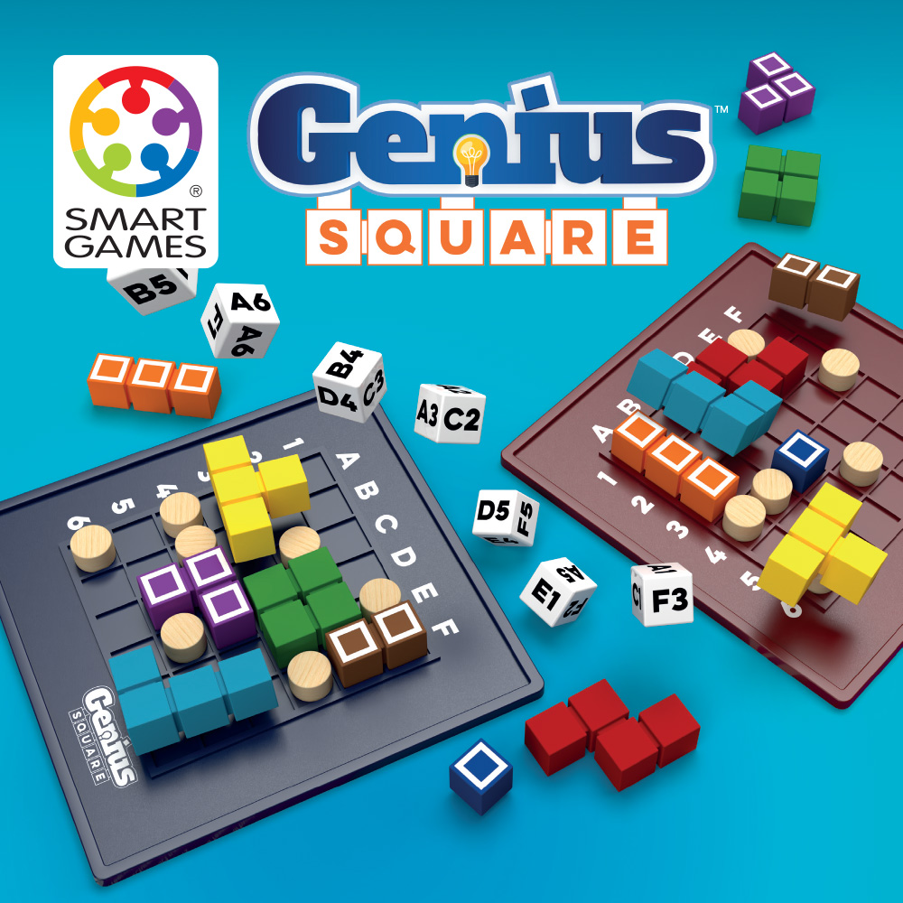
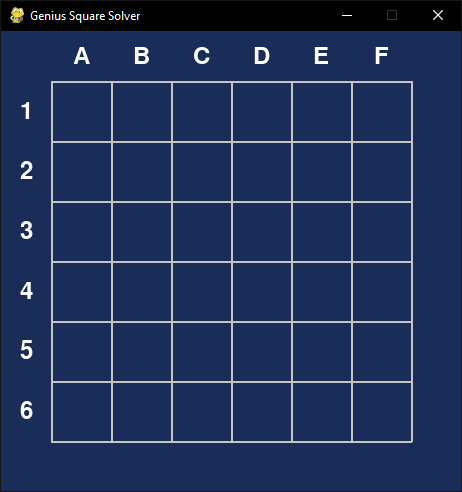
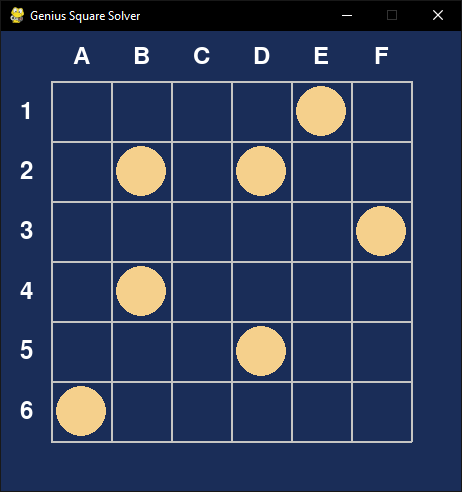
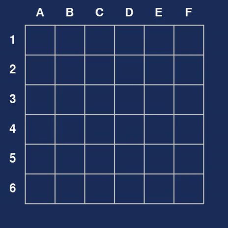

# Genius Square Solver



Link to the game : [Genius Square by SMART GAMES](https://www.smartgames.eu/fr/jeux-pour-1-joueur/genius-square)

## Description

The Genius Square Solver is a Python-based implementation of the popular Genius Square puzzle game. 
The game consists of a 6x6 grid and a set of polyomino pieces. 
The objective is to fit all the pieces into the grid while avoiding obstacles, 
which are randomly placed or user-defined.

## Rules of the Game

**Step 1:**

Roll the dice and place the 7 blockers into the squares matching the coordinates that appear on the dice.

**Step 2:**

Race your opponent to fill the empty spaces on the game board using the 9 puzzle pieces.

**Step 3:**

The first player to fill their game board wins the game.

## Features

- **Interactive Gameplay**: Add obstacles by clicking on the grid.
- **Automatic Solver**: Uses a backtracking algorithm or binary linear programming model to find solutions.
- **Reset Functionality**: Press `R` to reset the game and start over.

## Installation

1. Clone this repository:
   ```bash
   git clone https://github.com/yourusername/genius-square-solver.git
   ```
2. Navigate to the project directory:
   ```bash
   cd genius-square-solver
   ```
3. Install the required dependencies:
   ```bash
   pip install pygame
   pip install pulp
   ```
4. Run the game:
   ```bash
   python src/main.py
   ```

## How to use the solver

1. Run the program using Python.
2. Click on the grid to place the 7 blockers.
3. Watch the solver find a solution or reset the game by pressing `r`.

## Screenshots

### Initial Grid


### Adding Obstacles


### Solved Puzzle


## Technologies Used

- **Python**: Core programming language.
- **Pygame**: For rendering the grid and handling user interactions.
- **PuLP**: For solving the puzzle using linear programming.

## Solver logic

This project supports two distinct methods for solving The Genius Square puzzle:

### Backtracking Algorithm

The backpropagation algorithm is a special type of computer program. It tries all possible piece placements over and 
over again. If a placement doesn't work out, it tries something else.

It's simple and easy to understand. It's great for visual demonstrations or small grids.

The cons are:
- It can take a long time to process complex boards.
- It doesn't ensure the best performance.
- It might not be able to find unsolvable boards quickly.

### Linear Programming Solver

To efficiently solve the puzzle, we use a binary linear programming model, inspired by academic research 
(Garvie and Burkardt). 

Here's how it works:

1. Piece Modeling
Each of the 9 pieces is defined by its shape and all of its valid rotations (0°, 90°, 180°, 270°).

2. Placement Generation
For each piece, the solver generates all valid placements on the board that do not overlap any blockers.

3. Constraint Building
The system builds a binary linear system with two main rules:

   - Each piece must be used exactly once. 
   - Each empty square must be filled by exactly one piece.

4. Solving with Linear Programming
The system uses the pulp library to solve the binary constraint system efficiently. If a valid placement exists, the solution is shown on the grid in real time.

### Solver Performance

The linear programming solver is significantly faster than the backtracking algorithm, especially for larger grids or 
more complex configurations. It can handle unsolvable boards more efficiently by quickly determining if a solution exists.

linear programming solver : 100ms
Backtracking solver : 81ms

Time for no solution
- Backtracking solver : 1000 ms
- Linear programming solver : 75 ms

## Citation

Jensen, Noah, "Solving the Genius Square: Using Math and Computers to Analyze a Polyomino Tiling
Game" (2023). WWU Honors College Senior Projects. 711.
https://cedar.wwu.edu/wwu_honors/711 

## License

This project is licensed under the MIT License. See the LICENSE file for details.
